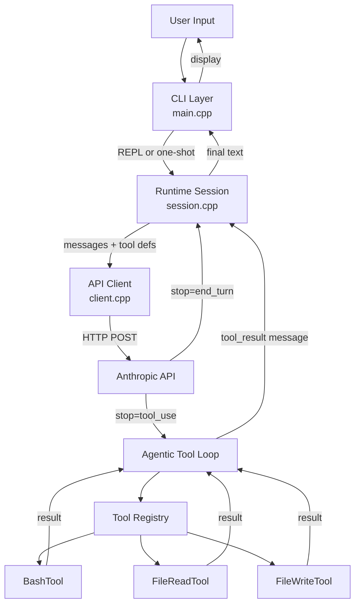

# Claw Code (C++ Edition) 🚀


A clean-room, highly-performant C++20 reimplementation of the **Claw Code AI Agent Harness**. 

Rather than being a simple chatbot that stops after a single reply, this is an **agentic loop architecture**. It integrates deeply with the Anthropic Messages API, sending explicit tool schemas to the model, and recursively executing local tools (like Bash and File I/O) on behalf of the AI until a task is completed.

---

## ⚡ Features

- **True Agentic Tool Loop:** Context-aware routing and recursive API calls.
- **Interactive REPL & One-Shot:** Native slash commands (`/quit`, `/clear`, `/usage`) and one-shot prompt scripts.
- **Built-in Tooling Layer:**
  - `BashTool`: Execute local shell scripts with configurable timeouts and output truncation guards.
  - `FileReadTool`: Read files up to 512KB to inspect codebases safely.
  - `FileWriteTool`: Write strings to files with automatic parent-directory creation.
- **Native Static Binary:** Builds to a fast, statically linked binary. Zero python/npm dependencies.
- **Context Compaction:** Auto-trims history past a certain turn limit to keep token window budgets low.

## 🏗️ Architecture Design



## 📁 Workspace Layout

```
claw-cpp-public/
├── CMakeLists.txt                    # Modern CMake build instructions
├── LICENSE                           # MIT License
├── README.md                         # This file
└── src/
    ├── api/                          
    │   ├── client.cpp/hpp            # HTTPS logic via cpp-httplib
    │   └── types.hpp                 # Rich API content block modeling (Variant)
    ├── cli/                          
    │   └── main.cpp                  # REPL CLI Interface & entrypoint
    ├── runtime/                      
    │   └── session.cpp/hpp           # Core agentic recursion loop
    └── tools/                        
        ├── itool.hpp                 # Modular Plugin interface
        ├── tool_registry.hpp         # Maps plugin names to logic
        ├── bash_tool.cpp/hpp         # Safe shell execution
        ├── file_read_tool.cpp/hpp    
        └── file_write_tool.cpp/hpp   
```

## 🚀 Getting Started

### Prerequisites

You need a C++20 compatible compiler and CMake.
For Windows users, you can use Winget:
```powershell
winget install Kitware.CMake
winget install Microsoft.VisualStudio.2022.BuildTools --override "--wait --quiet --add Microsoft.VisualStudio.Workload.VCTools --includeRecommended"
winget install ShiningLight.OpenSSL # Needed for HTTPS network calls
```

### Build Instructions

```bash
mkdir build
cd build

# Configure CMake (it will auto-download cpp-httplib, nlohmann-json, fmt, and CLI11)
cmake .. 

# Build the release binary
cmake --build . --config Release
```

### Usage

Export your API Key to the environment:
```powershell
# Windows
$env:ANTHROPIC_API_KEY="sk-ant-..."

# macOS/Linux
export ANTHROPIC_API_KEY="sk-ant-..."
```

Run the REPL:
```bash
./Release/claw-cpp
```

Run a one-shot query:
```bash
./Release/claw-cpp prompt "List the files in this directory and tell me what they are."
```
