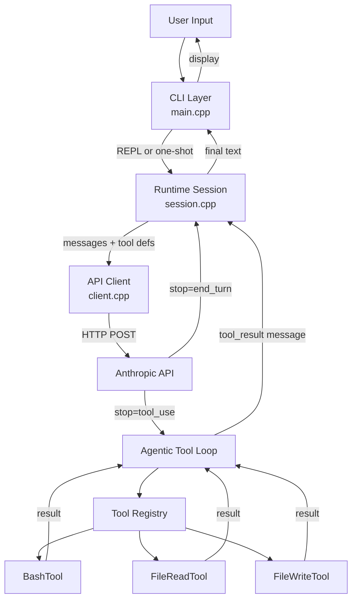

# Claw Code (C++ Educational Skeleton) 🛠️🤖


> **Transparency Note (Read First):** \ 
> This is **not** a port of the massive 500k LOC original Claw Code repository. This is a minimal, from-scratch skeleton project built explicitly as an exercise to explore what an agentic tool-loop looks like in C++. 
> 
> Furthermore, **the C++ architecture in this repository was entirely generated by Antigravity AI** (an agentic coding tool driven by advanced LLMs) under the guidance of Rayed Hasan. It was built to see if an AI could reconstruct a basic Claude-like loop in C++20. Expectations should be matched accordingly: it's a bare-bones architectural experiment, **not** a production-ready daily driver.

---

## What Actually Is This?

It is the absolute **minimum viable architecture** (MVA) required for an AI agent. Most coding agents are built in TypeScript/Python. We wanted to see what it would take to compile a tool-use loop directly to a native C++ binary. 

As noted by the community, this isn't magic. Under the hood, this is essentially a trivial HTTP loop that fetches tool requests and blindly shells out to system commands.

### What is included:
- **The Agentic Loop:** A recursive runtime that sends prompts, parses `stop_reason: tool_use`, executes local tools, feeds results back, and repeats.
- **3 Minimal Tools:**
  - `BashTool` (Uses `popen` to shell out. Capped at 50KB output to prevent hangs).
  - `FileReadTool` / `FileWriteTool`
- **Interactive REPL:** A basic terminal interface.

## Addressing Community Feedback 🗣️

When initially posting this concept, the hype heavily overstated the code's real capabilities. Based on very valid feedback, here is exactly what this project **lacks** and why you shouldn't use it for sensitive work yet:

### 1. Wait, there is ZERO permission control?
**Correct.** A capable, safe AI coding tool *must* have an `allow`/`ask`/`deny` permission system. Right now, this C++ skeleton just executes whatever bash command the LLM requests, completely unconditionally. Do not run this on sensitive systems without sandboxing. Building proper CLI permission barriers is a critical next step.

### 2. You said it's "highly performant" and "C++20"?
The phrase "highly performant" was just referring to the fact that it's a small static binary rather than spinning up a V8 Node engine. That's all. As for C++20, we just use `std::variant` to parse Anthropic's mixed `[TextBlock, ToolUseBlock]` arrays cleanly, alongside `fmt` and `nlohmann-json`. It's modern C++, but the underlying logic is incredibly basic.

### 3. What's next? (LSP / MCP)
Shelling out to `bash` for everything is messy and error-prone. The real interesting frontier developers should explore with this kind of native C++ skeleton is integrating **LSP (Language Server Protocol)** and **MCP (Model Context Protocol)**. That would allow the agent to actually "understand" codebases rather than blindly parsing `grep` outputs.

## 🏗️ Architecture Design



## 📁 Workspace Layout

```
claw-cpp-public/
├── CMakeLists.txt                    # Modern CMake build instructions
├── LICENSE                           # MIT License
├── README.md                         # This file
└── src/
    ├── api/                          
    │   ├── client.cpp/hpp            # HTTPS logic via cpp-httplib
    │   └── types.hpp                 # Rich API content block modeling (Variant)
    ├── cli/                          
    │   └── main.cpp                  # REPL CLI Interface
    ├── runtime/                      
    │   └── session.cpp/hpp           # Core agentic recursion loop
    └── tools/                        
        ├── itool.hpp                 # Modular Plugin interface
        ├── tool_registry.hpp         # Maps plugin names to logic
        ├── bash_tool.cpp/hpp         # Safe shell execution
        ├── file_read_tool.cpp/hpp    
        └── file_write_tool.cpp/hpp   
```

## 🚀 Getting Started

If you want to poke around the skeleton and experiment with C++ agent loops!

### Prerequisites

You need a C++20 compatible compiler and CMake.
For Windows users, you can use Winget:
```powershell
winget install Kitware.CMake
winget install Microsoft.VisualStudio.2022.BuildTools 
winget install ShiningLight.OpenSSL # Needed for HTTPS network calls
```

### Build Instructions

```bash
mkdir build
cd build

# Configure CMake (it will auto-download cpp-httplib, nlohmann-json, fmt, and CLI11)
cmake .. 

# Build the release binary
cmake --build . --config Release
```

### Usage

Export your Anthropic API Key to the environment (`$env:ANTHROPIC_API_KEY="sk-ant-..."`), and run the built `claw-cpp` executable.
